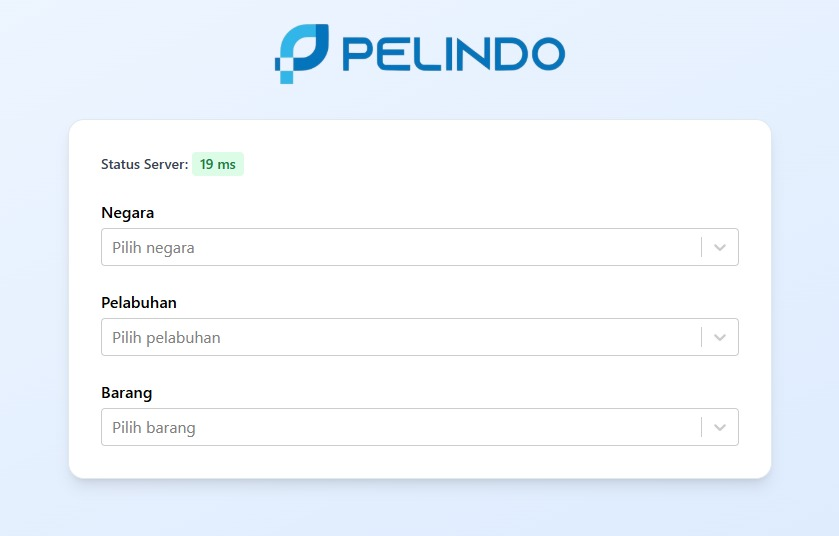

# Frontend Pelindo - Awalif Ghotamicha Irfan Saputra

Frontend berbasis React.js untuk pengisian data Pelindo

## Tech Stack

- React.js
- TailwindCSS v3
- Framer Motion
- Axios

---

## Cara Install & Jalankan

### 1. Clone Repository

```bash
git clone https://github.com/kangkoding/frontend-awalif-ghotamicha-irfan-saputra.git
cd frontend-awalif-ghotamicha-irfan-saputra

npm install
npm start
```


